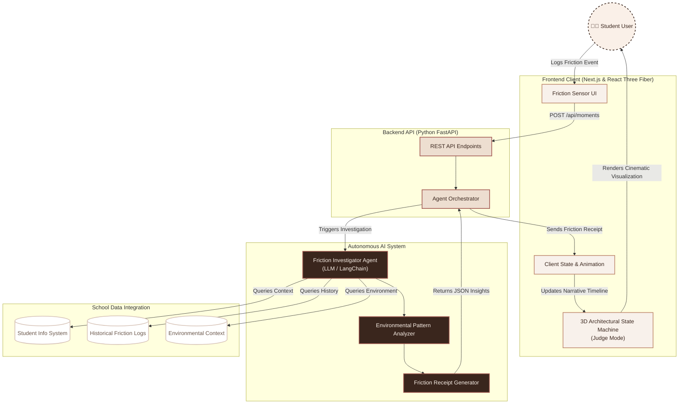

<div align="center">
  <br />
  <h1>FrictionTrace</h1>
  <p><strong>Stop measuring the child. Start measuring the friction.</strong></p>
  <p>An environment-first Agentic AI system that investigates recurring sources of friction to prevent student shutdowns before they happen.</p>
</div>

---

Schools often only see the breaking point—the moment a student shuts down, acts out, or refuses to engage. Our traditional response is to immediately ask, *"What is wrong with this child?"* and begin measuring their behavior. 

**FrictionTrace flips this paradigm.** 

Instead of treating the visible incident as the entire story, FrictionTrace captures environmental moments, connects them across time, autonomously investigates recurring patterns, and helps the student decide what happens next. It is an AI-powered architectural state machine that visualizes the invisible friction of the neurodivergent experience.

---

## 🛑 The Problem

**VISIBLE MOMENT ➔ WHAT HAPPENED BEFORE IT? ➔ REPEATED ENVIRONMENTAL FRICTION ➔ PATTERN**

Traditional school observation starts with the question: *"What happened to the student?"*
FrictionTrace asks: *"What happened around the student?"*

When a student has a meltdown on a Thursday, the traditional system records a behavioral incident for Thursday. But the child is not the problem; the environment is. 

What the system missed was that on Monday, the corridor was overwhelmingly crowded. On Tuesday, the cafeteria noise was deafening. On Wednesday, a schedule changed without warning. By Thursday, the student's sensory threshold was shattered. 

We need a system that tracks the environment, not the child.

---

## 💡 The Solution

FrictionTrace is a student-owned platform that logs "moments of friction" throughout the week. Instead of a disciplinary referral, an autonomous AI Agent acts as an investigator—querying the environment, comparing historical moments, and finding the hidden patterns without human bias.


### The "WOW" Moment: 3D Judge Mode
Instead of reading a boring JSON output of AI data, users can press **`J`** on their keyboard to enter **Judge Mode**. This triggers a cinematic 3D architectural state machine built in Three.js. The camera swoops into a beautiful architectural maquette, visually mapping the AI's narrative timeline to physical zones (Crowding, Noise, Transitions), proving mathematically that the breakdown was a result of compounded environmental friction.

---

## ⚙️ Technical Architecture

FrictionTrace is a full-stack application leveraging a heavily customized Agentic AI backend and a high-performance 3D frontend.



### Frontend: The Interface & State Machine
- **Framework:** Next.js (App Router) & React.
- **3D Engine:** React Three Fiber / Three.js for the interactive architectural maquette.
- **Animation:** Framer Motion for buttery-smooth UI transitions and state morphing.
- **Styling:** Custom Vanilla CSS focusing on a premium, tactile, "glassmorphic" aesthetic.
- **Data:** Client-side local storage and React Context (`SharedContext`) to ensure student data remains entirely in the student's control (*"Nothing about me without me"*).

### Backend: The Agentic Investigator
- **Framework:** Python FastAPI.
- **AI Orchestration:** LangGraph state machine.
- **LLMs:** Google Gemini 2.5 Flash as the primary reasoning engine, with an automatic fallback to Mistral AI (`mistral-large-latest`) ensuring high availability.
- **Observability:** LangSmith integration for tracing agent reasoning steps.

---

## 🧠 AI / Agentic Architecture

FrictionTrace doesn't just use AI as a chatbot. It uses a **LangGraph-powered Autonomous Agent** that executes a sophisticated investigative loop.

1. **Analyze Node:** Extracts structured environmental signals from the student's raw input.
2. **Investigate Node:** The LLM is bound to custom Python tools (`search_similar_moments`, `get_support_preferences`, `compare_similar_events`, `check_evidence_strength`). It autonomously queries local history to determine if an event is an isolated incident or a recurring pattern.
3. **Validate Node:** Ensures the agent has gathered sufficient mathematical evidence before making a claim.
4. **Safety Gate Node:** A rigorous dual-layer safety check (see below).
5. **Insight Generation:** Synthesizes verified tool outputs into an empowering, observational "Friction Receipt."

---

## 🛡️ Safety & Privacy Model

In neurodiversity tech, safety is paramount. We implemented a strict **Dual-Layer Guardrail System** to prevent the AI from medicalizing the student:

1. **Deterministic Guardrails:** Regex and keyword blocking that immediately flags clinical or diagnostic terms (e.g., "autism", "ADHD", "meltdown", "sensory overload disorder").
2. **LLM Policy Guardrails:** A secondary LLM pass strictly evaluates the agent's output against core policies:
   - *NO causal medical claims.*
   - *NO internal mental state predictions.*
   - *MUST use observational language.*

If any guardrail is tripped, execution halts and defaults to a safe, generic output.

---

## 🚀 How to Run

FrictionTrace is configured for seamless deployment on Vercel, running Next.js and Python serverless functions side-by-side.

### Prerequisites
- Node.js 18+
- Python 3.12+
- Gemini API Key (or Mistral API Key)

### Local Development

1. **Clone the repository**
   ```bash
   git clone https://github.com/yourusername/FrictionTrace.git
   cd FrictionTrace
   ```

2. **Install Frontend Dependencies**
   ```bash
   npm install
   ```

3. **Install Backend Dependencies**
   ```bash
   cd backend
   python -m venv venv
   source venv/bin/activate  # On Windows: venv\Scripts\activate
   pip install -r requirements.txt
   cd ..
   ```

4. **Environment Variables**
   Create a `.env.local` file in the root directory:
   ```env
   GEMINI_API_KEY=your_gemini_key_here
   MISTRAL_API_KEY=your_mistral_key_here
   LANGSMITH_TRACING=true
   LANGSMITH_API_KEY=your_langsmith_key
   LANGSMITH_PROJECT=frictiontrace-agent
   ```

5. **Run the Application**
   Start both the Next.js frontend and FastAPI backend concurrently:
   ```bash
   npm run dev
   ```
   *(Ensure uvicorn is running the backend on `localhost:8000`)*

### Vercel Deployment
The repository includes a `vercel.json` and root `requirements.txt` pre-configured for Vercel.
```bash
npx vercel --prod
```

---

## 🏆 Why FrictionTrace Deserves to Win

FrictionTrace isn't just a technical prototype; it's a completely realized philosophical shift. 

- **Exceptional UX/UI:** We bridged the gap between deep data analytics and breathtaking design. The 3D architectural Judge Mode is a show-stopping technical achievement.
- **Advanced Agentic AI:** We went beyond simple RAG or chatbots. We built a robust LangGraph agent with custom tool-binding and rigorous validation loops.
- **Real-World Safety:** We didn't ignore the dangers of AI in education. Our dual-layer deterministic and probabilistic guardrails prove we understand the ethical implications of this technology.
- **Deeply Mission-Driven:** We actively listened to the neurodivergent community to build a tool that adheres to the Social Model of Disability. 

FrictionTrace doesn't just measure data. It changes how we see the child.
